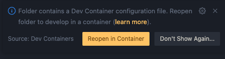

# Symbolic Regression with Genetic Programming and Differential Evolution

The provided code includes an implementation of the paper ["Using differential evolution for symbolic regression and numerical constant creation"](https://doi.org/10.1145/1389095.1389331) and a basic experiment setup with datasets from the [UCI Machine Learning Repository](https://archive.ics.uci.edu/).

The algorithm code is in the `src` directory, and `run.py` and `evaluate.py`  provide a starting point for running the code and analyzing the results. For the experiments, it is recommended to use parameter settings that lead to runs taking ~1 minute each, as you will need to do multiple repetitions on different datasets and cross-validation folds.

The Numba JIT compiler and some Python meta-programming was used to speed up the algorithm. This added compilation step will take longer on for the first run, but should barely be noticeable once the caching kicks in.
During development, I recommend disabling the Numba JIT compilation (by commenting out the JIT decorators) to get better debug information. Also, if at first it doesn't work, try increasing the population size and letting it run longer.

## Installation

### Using `conda` (Recommended)

You can find installation instructions for `conda` [here](https://docs.anaconda.com/free/miniconda/#quick-command-line-install).

```bash
# optional: use the faster libmamba solver
conda env create -f environment.yml --solver libmamba
# Note: deactivate any other active environments first (e.g. venv/poetry/conda/...)
conda activate cs4205-project

python -m src.ea
```

### Using a Devcontainer

Generally, you need [Docker](https://www.docker.com/products/docker-desktop/) and [editor support](https://containers.dev/supporting), then the editor will tell you what to do:


